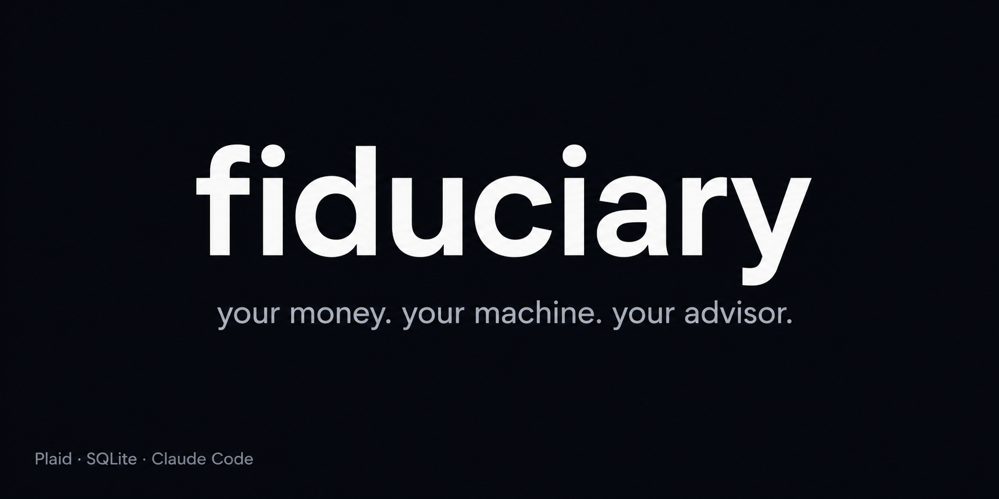

# Fiduciary

<p align="center">
  
</p>

[](https://skills.sh/weklund/fiduciary)
[](LICENSE)

A local-first personal finance advisor. Connects to your bank accounts, stores everything in SQLite on your machine, and uses an LLM agent as a conversational advisor — grounded in your real data, not generic platitudes.

> [!NOTE]
> **All data stays on your machine.** No cloud storage. No telemetry. No product recommendations. See [docs/PRIVACY.md](docs/PRIVACY.md) for full details.

```
You: "What did I spend on dining this month?"
Advisor: queries your local DB, shows the answer with merchants and totals

You: "Should I pay off my credit card or keep cash reserves?"
Advisor: walks your actual balances and rates through a priority framework,
         accounts for your constraints, gives a specific recommendation with the math
```

## Prerequisites

macOS or Linux (Windows via WSL) · Python 3.8+ · SQLite 3 · [Homebrew](https://brew.sh) · An [Agent Skills-compatible runtime](https://agentskills.io/clients)

<details>
<summary>Verify your setup</summary>

```bash
python3 --version   # 3.8+
sqlite3 --version   # any
brew --version      # any
```

All three come pre-installed on macOS. On Linux, install via your package manager.

</details>

## Quick Start

```bash
git clone https://github.com/weklund/fiduciary.git && cd fiduciary
git config core.hooksPath .githooks
brew install plaid/plaid-cli/plaid
```

<details>
<summary><strong>First-time Plaid setup</strong> (free account required)</summary>

```bash
plaid register     # opens browser — create a free Plaid developer account
plaid trial        # apply for the free Trial plan (auto-approved in ~60 seconds)
plaid login        # authenticate the CLI (opens browser for OAuth)
plaid keys fetch   # download your API keys
```

The Trial plan is free for personal use (up to 10 linked institutions).

</details>

```bash
plaid link --products transactions,liabilities,investments   # connect your bank (opens browser)
bash scripts/sync.sh                                         # pull data + build local DB
```

<details>
<summary><strong>Connect your agent</strong></summary>

**Claude Code** — open Claude Code in this directory. Skills auto-discover.

**Hermes Agent:**
```bash
cp CLAUDE.md ~/.hermes/SOUL.md
hermes skills add ./.claude/skills/*
```

**Other tools** — any [Agent Skills-compatible](https://agentskills.io/clients) runtime works (Gemini CLI, Cursor, GitHub Copilot, 42+ others).

</details>

Then run the advisor intake:

```
/onboard
```

This asks about your goals, situation, and risk tolerance — then writes a personalized profile so all future advice is tailored to you.

## Skills

| Command | What it does |
|---------|-------------|
| `/onboard` | Financial advisor intake — sets up your personalized profile |
| `/sync-data` | Pull fresh transactions from Plaid |
| `/finance-query` | Ask any question about your finances |
| `/next-dollar` | "What should I do with $X?" — applies order of operations to YOUR situation |
| `/health-check` | Quarterly full assessment — pyramid status, ratios, action plan |
| `/tactics` | Optimize your cards, accounts, and tools |
| `/spending-audit` | Find waste, unused subscriptions, overspending |
| `/weekly-report` | Generate a weekly spending summary |

## How It Works

```
┌─────────────┐     ┌──────────────┐     ┌─────────────────┐
│  Plaid CLI  │────▶│  SQLite DB   │◀────│  CSV Statements │
│  (live sync)│     │  (unified    │     │  (historical    │
└─────────────┘     │   ledger)    │     │   backfill)     │
                    └──────┬───────┘     └─────────────────┘
                           │
                    ┌──────▼───────┐
                    │  LLM Agent   │
                    │  (skills +   │
                    │   CLAUDE.md  │
                    │   frameworks)│
                    └──────────────┘
```

The advisory logic is built on the CFP Board's fiduciary planning process — a layered pyramid where you never optimize a higher layer while a lower one is unstable. See [docs/ADVISORY.md](docs/ADVISORY.md) for the full framework.

## Adding Historical Data

Plaid gives ~30 days. For deeper analysis, add bank CSVs:

```bash
# Drop CSVs into data/statements/, then:
python3 scripts/ingest.py
```

Supports: Amex, Chase, Capital One, or any CSV with `Date,Description,Amount` columns.

## Privacy & Security

This project handles your most sensitive data. We believe you deserve full transparency about what happens with it — not just marketing claims, but a published threat model you can read and challenge.

Your financial data never touches a git-tracked file. The only external calls are to Plaid (for sync) and your chosen LLM provider (for analysis).

**Recommended:** Commercial API key (7-day retention, no training). **Zero-trust:** Ollama locally (nothing leaves your machine).

| Document | What it covers |
|----------|---------------|
| [docs/PRIVACY.md](docs/PRIVACY.md) | Provider comparison, session logs, retention settings, credentials |
| [docs/THREAT-MODEL.md](docs/THREAT-MODEL.md) | Full STRIDE threat analysis — 15 threats, mitigations, accepted risks, runtime comparison |
| [docs/HLD-Fiduciary.md](docs/HLD-Fiduciary.md) | System architecture, trust boundaries, data classification |

<details>
<summary><strong>Connecting additional banks</strong></summary>

Run `plaid link` again for each institution:

```bash
plaid link --products transactions              # checking/savings only
plaid link --products transactions,investments  # brokerage accounts
```

Verify connections:
```bash
plaid item list      # list all linked institutions
plaid balance --all  # test that balances come back
```

**Common issues:**
- **Bank not found?** Most major US banks are supported. Some smaller credit unions may not be in Plaid's network.
- **`ITEM_LOGIN_REQUIRED`?** Bank session expired. Re-run `plaid link` to re-authenticate.
- **10-institution limit:** The free Trial allows 10 linked institutions.

</details>

<details>
<summary><strong>Updating your profile</strong></summary>

Run `/onboard` again anytime your situation changes:
- New job or lost income
- Major life event (marriage, kids, inheritance)
- Goals or priorities shift
- Want to add accounts or update metrics

The skill detects existing context and offers to update rather than start fresh.

</details>

<details>
<summary><strong>Project structure</strong></summary>

```
CLAUDE.md              ← Advisory frameworks (committed, no PII)
scripts/
  sync.sh              ← Pull from Plaid + rebuild DB
  ingest.py            ← Rebuild DB from all sources
.claude/skills/        ← Conversational finance skills (8 skills)
data/                  ← (gitignored) Financial data + SQLite DB
reports/               ← (gitignored) Generated reports
docs/                  ← Deep documentation
  ADVISORY.md          ← How the advisory logic works
  PRIVACY.md           ← Data retention + provider comparison
```

</details>

## Philosophy

> Track everything. Automate the boring stuff. Spend deliberately on what builds the future. Cut ruthlessly what doesn't.

This tool exists because most financial apps sell you products or harvest your data, generic advice doesn't account for YOUR situation, a financial advisor costs $200-400/hour, and your bank has the data.  You should too, queryable, on your terms.

## Contributing

See [CONTRIBUTING.md](CONTRIBUTING.md). Good first contributions: CSV parsers for new banks, new advisory skills, improved category detection.

## License

MIT
